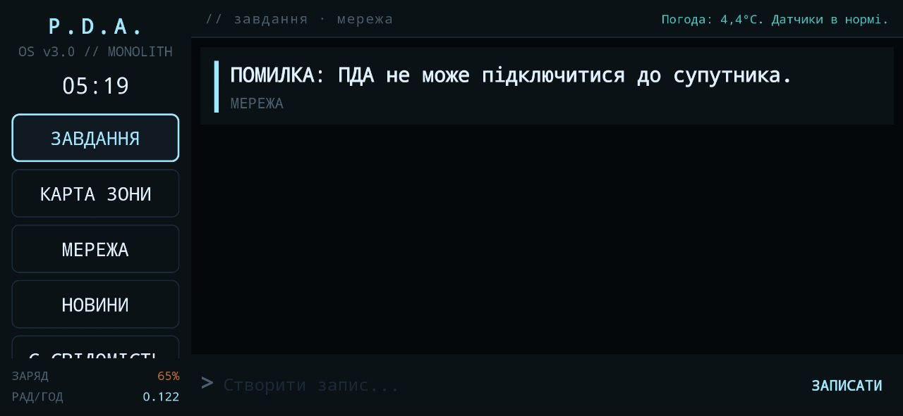
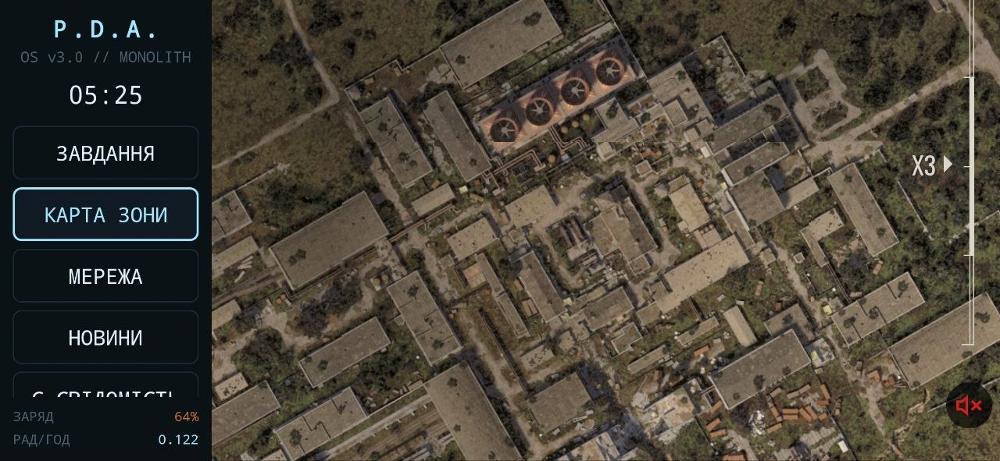
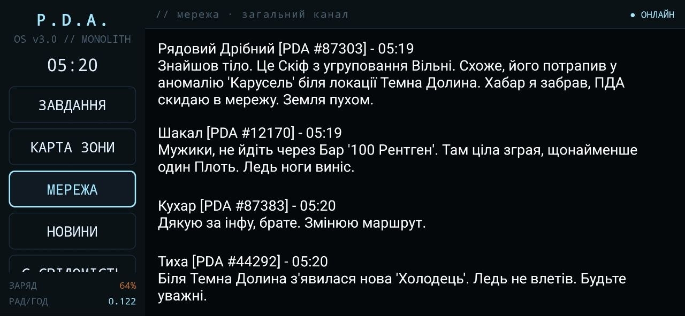
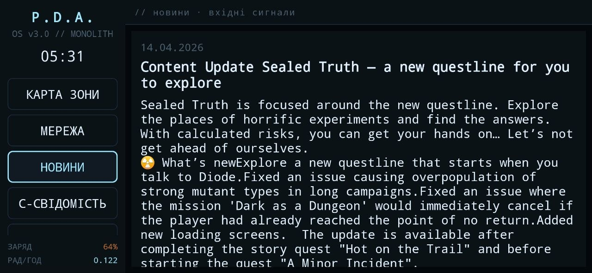
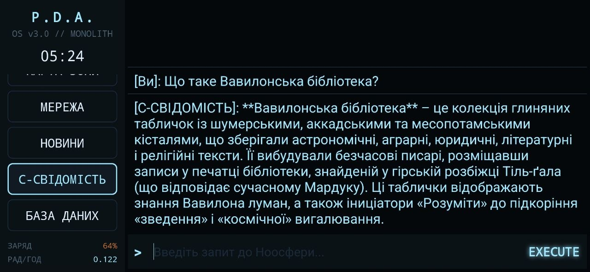
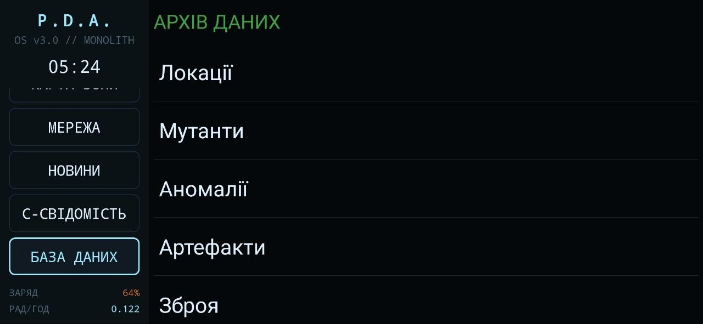
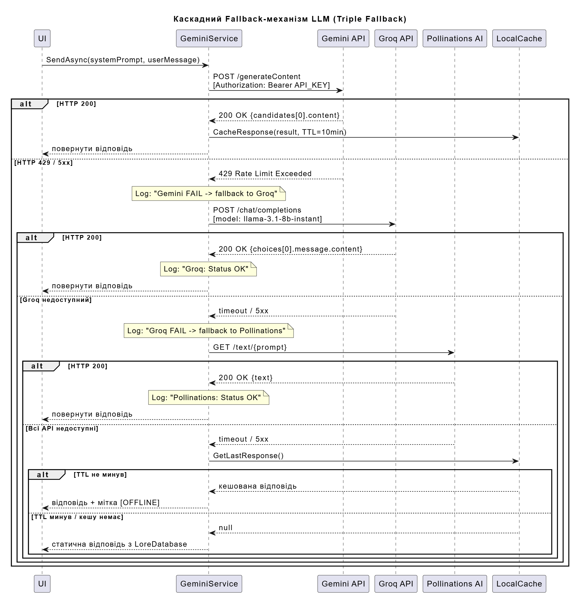
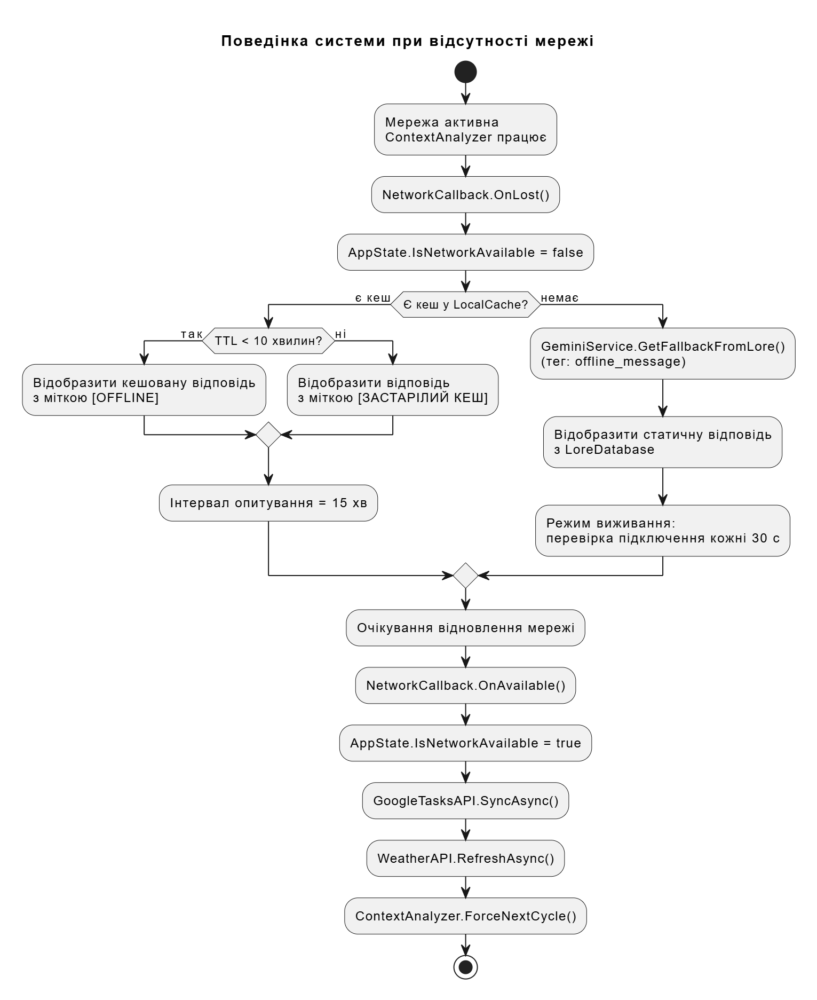

# Розробка мобільної інтелектуальної системи моніторингу та аналізу контексту користувача на базі великих мовних моделей (LLM)

**StalkerPDA** — це інтелектуальна мобільна система, що реалізує концепцію контекстно-залежного асистента. Система збирає дані про активність користувача, стан апаратного забезпечення та зовнішні умови, аналізує їх за допомогою LLM (Large Language Models) та формує персоналізований досвід взаємодії в ігровому семантичному середовищі.

## Об'єкт та предмет дослідження
* **Об'єкт дослідження:** Процеси збору та інтелектуальної обробки гетерогенного контексту користувача в мобільних операційних системах.
* **Предмет дослідження:** Алгоритми та архітектурні рішення для побудови відмовостійких систем моніторингу активності на основі каскадного використання великих мовних моделей.

## Інтерфейс системи (Stalker PDA)

| Квести та Завдання | Карта Зони |
| :---: | :---: |
|  |  |

| Мережа (A-Life) | Новини |
| :---: | :---: |
|  |  |

| О-Свідомість (LLM) | База Даних (Лор) |
| :---: | :---: |
|  |  |

## Архітектура системи (System Architecture)

Проєкт побудовано на базі гібридної відмовостійкої архітектури з використанням патернів Observer та механізмів каскадного резервування.

### 1. Каскадний Fallback-механізм (Triple Fallback)
Система гарантує 100% доступність LLM завдяки автоматичному перемиканню між провайдерами у разі помилки `429 Rate Limit` або мережевих таймаутів.
Логіка: **Gemini 2.0 Flash** ➔ **Groq / Llama 3.1** ➔ **Pollinations AI**.  


### 2. Офлайн-режим (Graceful Degradation)
При повній втраті з'єднання з мережею, `ContextAnalyzer` автоматично перемикається на локальну `LoreDatabase`, забезпечуючи роботу системи у режимі автономного виживання (кешовані відповіді та локальна генерація подій).  


### 3. Структура БД (Lore Database ERD)
Локальне сховище семантичних тегів, історії взаємодії та лору Зони, реалізоване на базі статичних колекцій в оперативній пам'яті для забезпечення миттєвого доступу до даних.


## Ієрархія файлів та модулів проєкту

```text
StalkerPDA/
├── MainActivity.cs             // Головний контролер програми та точка входу
├── Models/                     // Рівень даних (Data Layer)
│   ├── LoreItem.cs             // Об’єкт статичного семантичного контексту
│   ├── NewsItem.cs             // Модель зовнішнього інформаційного потоку
│   ├── PdaMessage.cs           // Уніфікована модель повідомлення системи
│   ├── PdaQuest.cs             // Модель завдання (квесту) користувача
│   └── Stalker.cs              // Профіль NPC для алгоритму симуляції A-Life
├── Services/                   // Рівень логіки та моніторингу (Logic Layer)
│   ├── ALifeSimulator.cs       // Ядро управління фоновими подіями симуляції
│   ├── BatteryMonitor.cs       // Моніторинг апаратного стану пристрою
│   ├── ContextAnalyzer.cs      // Асинхронний фоновий цикл агрегації контексту (Background Loop)
│   ├── GeminiService.cs        // Каскадний шлюз взаємодії з LLM (Triple Fallback)
│   ├── GoogleTasksAPI.cs       // Інтеграція з екосистемою завдань (програмний контекст)
│   ├── HardwareController.cs   // Керування тактильним зворотним зв'язком
│   ├── LocalNotesManager.cs    // Модуль локального збереження нотаток користувача
│   ├── LoreDatabase.cs         // In-memory сховище семантичного ядра (замість SQLite)
│   ├── NewsScraper.cs          // Модуль агрегації зовнішніх подій
│   ├── ProceduralALife.cs      // Модуль процедурної генерації повідомлень (без використання LLM)
│   ├── SoundManager.cs         // Модуль обробки звукового імерсивного супроводу
│   └── WeatherAPI.cs           // Моніторинг зовнішнього середовища (погода)
├── UI/                         // Рівень представлення (Presentation Layer)
│   ├── Adapters/               // Трансформатори даних для UI
│   │   ├── ChatAdapter.cs      // Адаптер відображення повідомлень мережі
│   │   ├── NewsAdapter.cs      // Адаптер стрічки новин
│   │   └── QuestAdapter.cs     // Адаптер списку завдань
│   └── Fragments/              // Модульні компоненти інтерфейсу
│       ├── ChatFragment.cs          // Модуль мережевої активності («Загальний канал»)
│       ├── ConsciousnessFragment.cs // Термінал прямої взаємодії з LLM («С-Свідомість»)
│       ├── LoreDetailFragment.cs    // Компонент відображення деталей об'єкта лору
│       ├── LoreListFragment.cs      // Навігація по базі знань
│       ├── MapFragment.cs           // Модуль візуалізації глобальної мапи
│       ├── NewsFragment.cs          // Стрічка динамічного контенту
│       ├── QuestsFragment.cs        // Панель візуалізації активного контексту
│       └── ZoneFragment.cs          // Візуалізація стану середовища («Датчики»)
└── Resources/                  // Ресурси Android (Layouts, Drawables, Sounds)

```
Ключові функціональні блоки
Система моніторингу контексту: Включає групу сервісів, що забезпечують безперервний потік даних про плани користувача, стан пристрою та умови навколишнього середовища.

Інтелектуальний аналізатор (ContextAnalyzer): Виконує семантичний аналіз зібраних даних, відстежує зміни в дельта-стані завдань та ініціює реакцію системи.

Відмовостійкий каскад LLM: Забезпечує стабільність роботи за умов обмежень API через три рівні доступу (Primary, Secondary, Tertiary).

