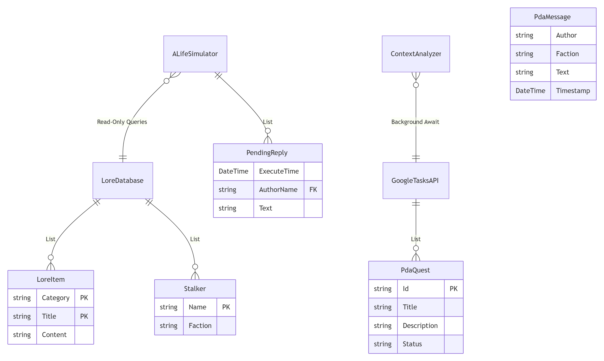

# Розробка мобільної інтелектуальної системи моніторингу та аналізу контексту користувача на базі великих мовних моделей (LLM)

**StalkerPDA** — це інтелектуальна мобільна система, що реалізує концепцію контекстно-залежного асистента. Система збирає дані про активність користувача, стан апаратного забезпечення та зовнішні умови, аналізує їх за допомогою LLM (Large Language Models) та формує персоналізований досвід взаємодії в ігровому семантичному середовищі.

## Об'єкт та предмет дослідження
* **Об'єкт дослідження:** Процеси збору та інтелектуальної обробки гетерогенного контексту користувача в мобільних операційних системах.
* **Предмет дослідження:** Алгоритми та архітектурні рішення для побудови відмовостійких систем моніторингу активності на основі каскадного використання великих мовних моделей.

## Інтерфейс системи (Stalker PDA)

| Квести та Завдання | Карта Зони |
| :---: | :---: |
|  |  |

| Мережа (A-Life) | Новини |
| :---: | :---: |
|  |  |

| О-Свідомість (LLM) | База Даних (Лор) |
| :---: | :---: |
|  |  |

## Архітектура системи (System Architecture)

Проєкт побудовано на базі гібридної відмовостійкої архітектури з використанням патернів Observer та механізмів каскадного резервування.

### 1. Каскадний Fallback-механізм (Triple Fallback)
Система гарантує 100% доступність LLM завдяки автоматичному перемиканню між провайдерами у разі помилки `429 Rate Limit` або мережевих таймаутів.
Логіка: **Gemini 2.0 Flash** ➔ **Groq / Llama 3.1** ➔ **Pollinations AI**.  


### 2. Офлайн-режим (Graceful Degradation)
При повній втраті з'єднання з мережею, `ContextAnalyzer` автоматично перемикається на локальну `LoreDatabase`, забезпечуючи роботу системи у режимі автономного виживання (кешовані відповіді та локальна генерація подій).  


### 3. Структура БД (Lore Database ERD)
Локальне сховище семантичних тегів, історії взаємодії та лору Зони, реалізоване на базі статичних колекцій в оперативній пам'яті для забезпечення миттєвого доступу до даних.


## Ієрархія файлів та модулів проєкту

```text
StalkerPDA/
├── MainActivity.cs             // Головний контролер програми
├── Models/                     // Рівень даних (Data Layer)
│   ├── LoreItem.cs             // Об’єкт статичного семантичного контексту
│   ├── NewsItem.cs             // Модель зовнішнього інформаційного потоку
│   ├── PdaMessage.cs           // Уніфікована модель повідомлення системи
│   └── Stalker.cs              // Профіль суб’єкта аналізу (користувача)
├── Services/                   // Рівень логіки та моніторингу (Logic Layer)
│   ├── ContextAnalyzer.cs      // Ядро аналізу контексту та прийняття рішень
│   ├── GeminiService.cs        // Каскадний шлюз LLM (Triple Fallback)
│   ├── GoogleTasksAPI.cs       // Моніторинг програмного контексту (завдання)
│   ├── BatteryMonitor.cs       // Моніторинг апаратного стану пристрою
│   ├── WeatherAPI.cs           // Моніторинг зовнішнього середовища (погода)
│   ├── NewsScraper.cs          // Модуль агрегації зовнішніх подій
│   ├── ALifeSimulator.cs       // Генератор динамічних подій (A-Life)
│   ├── LoreDatabase.cs         // Локальне сховище семантичного ядра
│   └── HardwareController.cs   // Керування тактильним зворотним зв'язком
├── UI/                         // Рівень представлення (Presentation Layer)
│   ├── Fragments/              // Модульні компоненти інтерфейсу
│   │   ├── ConsciousnessFragment.cs // Термінал прямої взаємодії з LLM
│   │   ├── QuestsFragment.cs        // Панель візуалізації активного контексту
│   │   ├── ChatFragment.cs          // Модуль мережевої активності
│   │   ├── NewsFragment.cs          // Стрічка динамічного контенту
│   │   └── LoreListFragment.cs      // Навігація по базі знань
│   └── Adapters/               // Трансформатори даних для UI
│       ├── ChatAdapter.cs
│       ├── NewsAdapter.cs
│       └── QuestAdapter.cs
└── Resources/                  // Ресурси Android (Layouts, Drawables)

```
Ключові функціональні блоки
Система моніторингу контексту: Включає групу сервісів, що забезпечують безперервний потік даних про плани користувача, стан пристрою та умови навколишнього середовища.

Інтелектуальний аналізатор (ContextAnalyzer): Виконує семантичний аналіз зібраних даних, відстежує зміни в дельта-стані завдань та ініціює реакцію системи.

Відмовостійкий каскад LLM: Забезпечує стабільність роботи за умов обмежень API через три рівні доступу (Primary, Secondary, Tertiary).

Технологічний стек
Платформа: .NET 10.0 (Android)

Мова: C# 13

API: Google Tasks API (OAuth 2.0), OpenWeather API.

LLM: Gemini 2.0 Flash, Llama-3.1-8b-instant.

Встановлення та налаштування
Клонуйте проєкт: git clone https://github.com/phrnxx/StalkerPDA.git

Відкрийте у Visual Studio 2022.

Налаштуйте ключі API в константах GeminiService.cs.

Виконайте збірку (Rebuild) для завантаження NuGet-пакетів.
